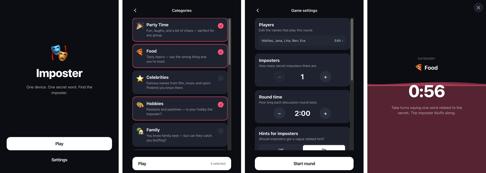

# Imposter

A single-device "find the imposter" party game. Pass the phone around: everyone holds to reveal their secret word, except one player who sees `IMPOSTER` and has to bluff. After the round timer, vote anonymously and unmask them.

Hey, this game is now available at **https://imposter.ma.ttias.be/** — installable as a PWA, fully offline once loaded. No tracking, no analytics, no accounts; everything runs client-side and nothing ever leaves the device (player names and settings live in `localStorage`).

<p align="center">
  
</p>

## Stack

React 19 · TypeScript · Vite · Tailwind · vite-plugin-pwa.

## Run it locally

```bash
npm install
npm run dev
```

Production build + offline preview:

```bash
npm run build
npm run preview
```

## Self-hosting

The build is a static `dist/` directory — any static host works. A reference [`Caddyfile.example`](Caddyfile.example) is included with the cache-control headers and security headers used in production. Replace the placeholders with your domain and paths, drop it into Caddy's site-config directory, and `rsync` the `dist/` after each build.

## Contributing words

Word lists live as JSON in [`src/locales/<locale>/words/`](src/locales). To add or edit content, no code changes are needed — just edit the JSON.

To add a new language, drop a folder next to `nl-BE/` and `en/` mirroring its structure, then add the locale code to `AVAILABLE_LOCALES` in [`src/i18n/locales.ts`](src/i18n/locales.ts).

## Licence

MIT. The theatre-masks app icon is a custom AI-generated illustration; the source PNG and regeneration steps live in [`design/`](design/).

## Changelog

### 2026-05-03
- Hide the Start button in Settings when opened from the home screen
- Default round time is now 30 seconds × player count
- Exit a round from the handoff and reveal screens, not just the timer

### 2026-04-28
- Expanded and refreshed word lists across categories and locales
- Bumped default round time to 3 minutes and defaulted vote mode to group
- Boxing-bell cue when the round timer hits zero
- Timer screen now shows who starts the round
- README screenshots: home, categories, settings, and a live round

### 2026-04-27
- "Force refresh" escape hatch under the version hash (PWA only)
- Footers now blend with the page (dropped the `bg-surface` action bar)
- Round-screen ✕ pushed below the iOS safe-area inset
- PWA icon centered by alpha centroid instead of bbox
- Cache-bust icons and entry points so deploys propagate immediately
- New custom AI-generated theatre-masks app icon

